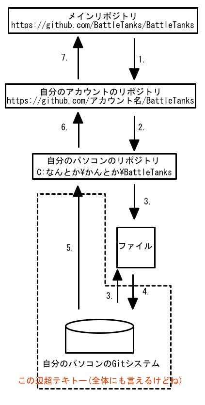

# BattleTanks
## プログラミング言語論のプロジェクト
目標としては[Spectre](http://www.myabandonware.com/game/spectre-19k)というゲームをWebGLを用いて実現させること．

## 初めに
とりあえずWegGLが自分の環境で動作することを確認するために

1. 「[webgl_test.html](https://github.com/BattleTanks/BattleTanks/blob/master/webgl_test.html)」のリンク先に行く．
2. ソースコードをテキストエディタにコピペするなりして同じ名前(webgl_test.html)で保存する．
3. ウェブブラウザで保存したファイルを開く．
4. 緑の三角形が表示されたらOKです．

## Gitとは
Gitとはバージョン管理システムのこと．  

例えば編集したファイルを保存したが，編集する前の方が良かったな〜と思ったとする．  
Gitにファイルの編集した記録(バージョン)を保存していれば前の状態に戻すことができる．  

また，複数人で開発を行っていたとする．  
Gitでお互いの進行状況を管理すれば他人によるファイルの上書きといった面倒な問題に対処できる．

というか[ここ](http://www.backlog.jp/git-guide/intro/intro1_1.html)読んでください．

### 用語説明(超テキトー)
* 用語(英語) : 読み : Gitでの意味
* Local : ローカル : 自分のパソコン内
* Remote : リモート : サーバ
* Repository : リポジトリ : ソース保管場所
* Fork : フォーク : リポジトリの分岐
* Clone : クローン : リポジトリの複製
* Branch : ブランチ : プロジェクト内の分岐
* Add : アッド : 記録するものの追加
* Commit : コミット : 記録の確定
* Push : プッシュ : 記録を別のリポジトリに同期させる
* Pull : プル : 別のリポジトリと記録を同期する

## GitHubでの開発の流れ
1. メインリポジトリを自分のGitアカウントにフォークする．
2. フォークしたリポジトリを自分のパソコンにクローンする．
3. ファイルを編集する．
4. 編集したファイルをアッドする．
5. 編集の記録をコミットする．
6. 編集の記録を自分のGitアカウントのリポジトリにプッシュする．
7. 編集の記録をメインリポジトリが取り込むように要請する．
8. メインリポジトリと記録を同期する．
9. 3に戻る．

### 1. メインリポジトリを自分のGitアカウントにフォークする．
### 2. フォークしたリポジトリを自分のパソコンにクローンする．
### 3. ファイルを編集する．
### 4. 編集したファイルをアッドする．
### 5. 編集の記録をコミットする．
### 6. 編集の記録を自分のGitアカウントのリポジトリにプッシュする．
### 7. 編集の記録をメインリポジトリが取り込むように要請する．
### 8. メインリポジトリと記録を同期する．
### 9. 3に戻る．

## 今後どうするか
具体的な開発の流れは後で考えることにしよう...
